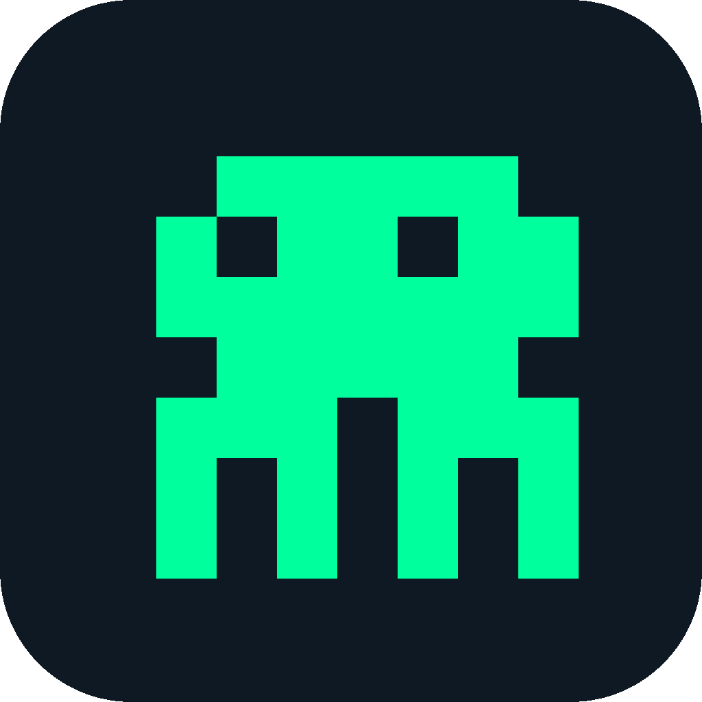

<p align="center">
  
</p>

<h1 align="center">WhichClaw</h1>

<p align="center">
  <strong>AI 模型可视化切换与配置管理中心</strong>
</p>

<p align="center">
  <a href="https://github.com/ebenxp707-boop/WhichClaw/releases">
    
  </a>
  
</p>

<p align="center">
  <a href="../README.md">English</a> ·
  <a href="./README.zh-CN.md">简体中文</a> ·
  <a href="./README.ja.md">日本語</a> ·
  <a href="./README.ko.md">한국어</a>
</p>

---

## ✨ WhichClaw 是什么？

WhichClaw 是一个桌面应用程序，为你的编程工具提供**可视化、统一的** AI 模型管理界面。告别手动编辑配置文件，告别 Token 焦虑——点击即切换。

### 痛点

- 😫 在 OpenClaw 等工具中切换模型需要手动编辑配置文件
- 💸 无法直观了解各工具的 Token 消耗情况
- 🔄 每个工具的模型配置格式都不一样
- 🔑 API Key 散落在多个配置文件中

### 解决方案

WhichClaw 作为所有 AI 编程工具的**统一控制面板**：

- 🎯 **一键切换模型** — 可视化界面，为任意工具切换 AI 模型
- 📊 **Token 用量监控** — 实时追踪消耗和费用
- 🔐 **安全密钥管理** — 加密存储 API Key，硬件绑定保护
- 🖥️ **本地模型支持** — 通过 llama.cpp 本地运行开源模型（Llama、Mistral 等）
- 🎮 **内置 AI 试验场** — 用 AI 黑白棋等互动游戏测试模型效果

## 🚀 快速开始

### 下载

| 平台 | 下载 |
|------|------|
| Windows | [WhichClaw-Setup.exe](https://github.com/ebenxp707-boop/WhichClaw/releases/latest) |
| macOS | [WhichClaw.dmg](https://github.com/ebenxp707-boop/WhichClaw/releases/latest) |
| Linux | [WhichClaw.AppImage](https://github.com/ebenxp707-boop/WhichClaw/releases/latest) |

### Linux 用户注意

```bash
chmod +x WhichClaw-*.AppImage
./WhichClaw-*.AppImage
```

> 如遇 FUSE 错误：`sudo apt install libfuse2`

## 🔧 支持的工具

| 工具 | 状态 | 模型切换 | 协议 |
|------|------|---------|------|
| OpenClaw | ✅ 已支持 | ✅ | OpenAI / Anthropic |
| Claude Code | ✅ 已支持 | ✅ | Anthropic |
| Cline | ✅ 已支持 | ✅ | OpenAI / Anthropic |
| Continue | ✅ 已支持 | ✅ | OpenAI |
| Aider | ✅ 已支持 | ✅ | OpenAI |
| OpenCode | ✅ 已支持 | ✅ | OpenAI |
| Codex | ✅ 已支持 | ✅ | OpenAI |
| Roo Code | 🔜 即将支持 | — | — |

## 🏗️ 技术栈

- **Electron** — 跨平台桌面框架
- **React + TypeScript** — UI 框架
- **Tailwind CSS** — 样式
- **Vite** — 构建工具
- **llama.cpp** — 本地模型推理

## 🛠️ 开发

```bash
# 安装依赖
npm install

# 启动开发服务器
npm run dev

# 构建生产版本
npm run build
```

## 📄 许可证

[MIT](../LICENSE)

---

<p align="center">
  Made with 💚 by the WhichClaw Team
</p>
